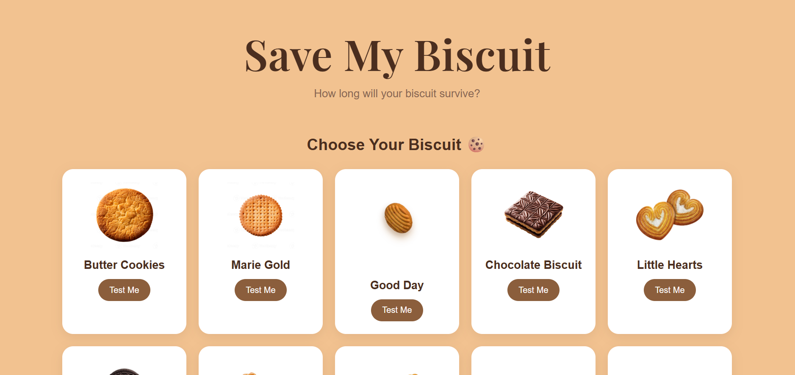

# [Save My Biscuit] 🎯

## Basic Details
### Team Name: [PrarthanaAlfa]

### Team Members
- Team Lead: [Prarthana J] - [KAHM Unity Women's College, Manjeri(Autonomous)]
- Member 2: [Alfa Thasneem M] - [KAHM Unity Women's College, Manjeri(Autonomous)]
- 
### Project Description
[ A fun and useless web project that tests how long different biscuits can survive when dipped in tea using biscuit characteristics, image analysis, and a survival score. ☕]

### The Problem (that doesn't exist)
[How long can a biscuit survive when dipped in tea?]

### The Solution (that nobody asked for)
[People have never needed to know which biscuit can survive the longest tea dunk. So, we decided to solve this completely unnecessary problem. ☕]

## Technical Details
### Technologies/Components Used
For Software:
- [HTML,CSS,JavaScript]
- [None]
- [None]
- [VS Code,OpenCode,Git,GitHub,Live Server]

For Hardware:
- [Laptop]
- [Windows 11]
- [Keyboard,mouse,Internet Connection]

### Implementation
For Software:
1. Download or clone the project from GitHub.
2. Open the project folder in VS Code.
3. Open index.html using Live Server.
# Installation
[npm install -g opencode-ai]

# Run
[Open the project folder in VS Code.
Open index.html using Live Server.
The website will run in the browser at:
http://127.0.0.1:5500/]

### Project Documentation
For Software:
Project Name: Save My Biscuit
Technologies: HTML, CSS, JavaScript
AI Coding Tool: OpenCode
Code Editor: VS Code
Development Tool: Live Server
Version Control: Git & GitHub
Main Features: Biscuit selection, tea-dipping animation, survival score calculation, result display, and custom biscuit image upload.
Purpose: A fun and useless project that solves a problem that does not exist — finding out how long a biscuit can survive a tea dunk. ☕

# Screenshots (Add at least 3)
* 1. Home Page
!
!https://drive.google.com/file/d/1kqoeMqJvPE7V30YQUICTTKb5UpigRzRv/view?usp=drive_link
2. Home Page 2

https://drive.google.com/file/d/1CgbnGakP2Y36oMDYXxAYo2z4QRsalL23/view?usp=drive_link
3. Home Page 3

https://drive.google.com/file/d/1Nx-wlISBGc_qLMfeEeNUxXDLs6yOILxm/view?usp=drive_link
*Shows the biscuit collection where users can choose a biscuit or test their own biscuit.*

4. Tea Dipping test

https://drive.google.com/file/d/1ZE9z4D5588o3l0V5TGIFvF832bjVV_Q9/view?usp=drive_link
*Shows the selected biscuit being dipped into the tea with the survival timer and animation.*
5. Survival Test

https://drive.google.com/file/d/1iEz5fq2BEun8ceP_BspkbY7_QrtCrD-2/view?usp=drive_link
*Shows the biscuit's survival time, survival score, and final survival category.*

6. Upload Your Own 1

https://drive.google.com/file/d/1YL2heuithH6hLu7qTeqnTKWvYNd0G_YT/view?usp=drive_link
7. Upload Your Own 2

https://drive.google.com/file/d/13DJw1D8OA4-vbPMiPz7iLZWi79_HjzFl/view?usp=drive_link
8. Upload Your Own 3

https://drive.google.com/file/d/1lUc_SNIUCfVSHa3hLlNDmmK1OL6pVavv/view?usp=drive_link
*Shows the option to upload a custom biscuit image and test its survival.*

# Diagrams
!Choose Biscuit / Upload Biscuit
           ↓
Display Biscuit Image 🍪
           ↓
Analyse Biscuit Characteristics 🧠
           ↓
Calculate Survival Score 📊
           ↓
Tea Dipping Animation ☕
           ↓
Calculate Survival Time ⏱️
           ↓
Display Result 🏆
           ↓
Try Another Biscuit
*Workflow showing the complete Biscuit Survival Test process, from selecting or uploading a biscuit to tea dipping, survival analysis, and the final result.*

### Project Demo
# Video
[<video controls src="20260911-1038-45.3404533.mp4" title="Title"></video>]
*The video demonstrates the Biscuit Survival Test, including biscuit selection, tea-dipping animation, survival analysis, survival score, final result, and the option to upload and test a custom biscuit.*

## Team Contributions
- [Prarthana J]: [HTML, CSS, and JavaScript coding, UI implementation, tea-dipping animation, biscuit selection, image upload feature, survival calculation, and testing.]
- [Alfa Thasneem M]: [Project idea and concept development, creation of project images and visual assets, feature planning, testing, and documentation.]
---
Made with ❤️ at TinkerHub Useless Projects 

